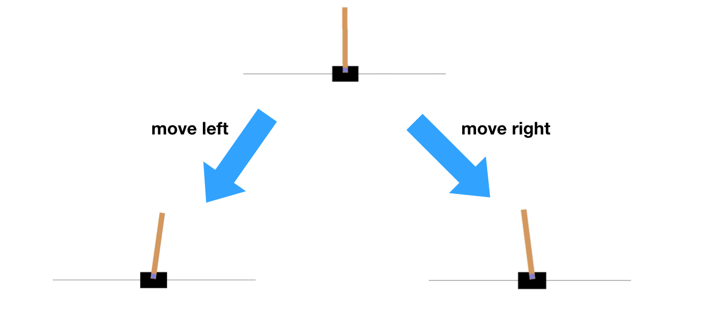
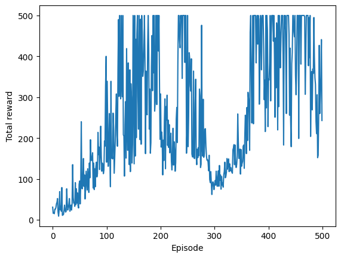
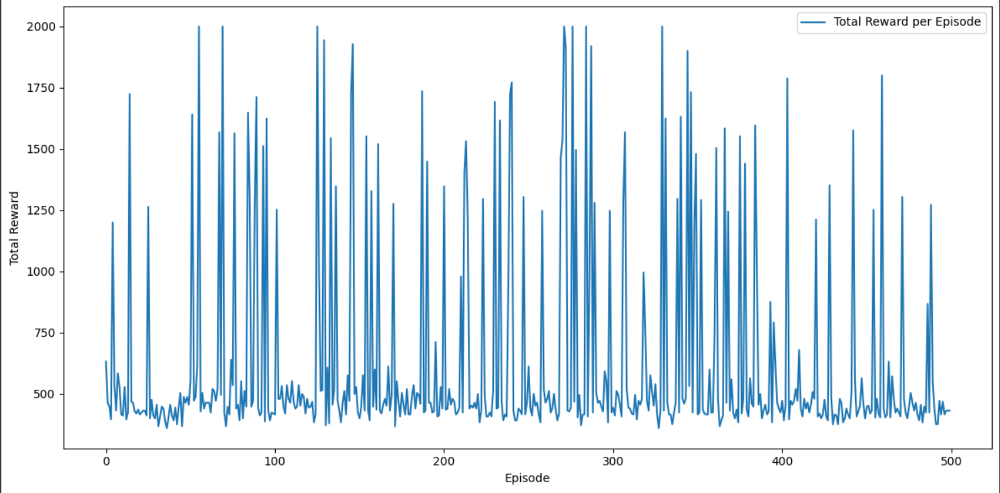

# TD 1 : Hands-On Reinforcement Learning

MSO 3.4 Apprentissage Automatique

## Liste des fichiers

- `img folder`: Contient les résultats de chaque partie
- `reinforce_cartpole.py` : Code de la première partie REINFORCE sur CartPole
- `a2c_sb3_cartpole.py` : Code de la deuxième partie Stable-Baselines3 sur CartPole
- `a2c_sb3_panda_reach.py` : Code de la troisième partie Full workflow avec panda-gym


## Utilisation

0- Installer une version Python 3.10 ou ultérieure est requise.

1- Pour utiliser ce dépôt, il faut d'abord installer les bibliothèques essentielles ci-dessous :

```sh
pip install gym==0.26.2
pip install pyglet==2.0.10
pip install stable-baselines3
pip install moviepy
pip install huggingface-sb3==2.3.1
pip install wandb tensorboard
pip install panda-gym==3.0.7
```

2- Exécution du code dans votre terminal préféré :

```sh
python3 "nom du fichier python"
```

Remplacez `"nom du fichier python"` par le nom réel du fichier script Python que vous souhaitez exécuter.

## I - Implémentation de l'algorithme REINFORCE sur CartPole

### Vue d'ensemble

Cette partie implémente l'algorithme REINFORCE (Monte Carlo Policy Gradient), appliqué à l'environnement CartPole-v1 de OpenAI Gym. L'objectif est de former un agent pour équilibrer un poteau sur un chariot le plus longtemps possible en déplaçant le chariot vers la gauche ou la droite. L'implémentation de cette partie est dans le fichier python `reinforce_cartpole.py`.

<div align = "center">

</div>

### Algorithme

REINFORCE est une méthode de gradient de politique où la politique est directement optimisée. Il utilise les retours complets des épisodes pour mettre à jour les poids du réseau de politique, encourageant les actions qui résultent en des retours plus élevés.

### Instalation


```sh
pip install gym==0.26.2
pip install pyglet==2.0.10
```


### Architecture du réseau

La politique de l'agent est modélisée par un réseau de neurones avec les couches suivantes :
- Une couche entièrement connectée de 128 unités avec activation ReLU, suivie d'une couche de dropout pour prévenir le surajustement.
- Une seconde couche entièrement connectée qui sort les probabilités d'action, avec activation softmax.

### Entraînement

L'entraînement se déroule sur 500 épisodes où l'agent interagit avec l'environnement. À chaque pas de temps d'un épisode, l'agent :
- Calcule les probabilités d'action en utilisant le réseau de politique.
- Échantillonne une action basée sur ces probabilités.
- Réalise l'action dans l'environnement et observe la récompense.

Après chaque épisode, les retours sont calculés avec un facteur de remise de `gamma = 0,99`, normalisés, et utilisés pour mettre à jour les poids du réseau de politique par rétropropagation. L'optimiseur Adam est utilisé avec un taux d'apprentissage de `5e-3`.

### Résultats

<div align = "center">

</div>

Le graphique ci-dessus illustre les récompenses totales obtenues par l'agent à chaque épisode pendant l'entraînement. Comme on peut le voir, les performances de l'agent montrent une grande variance au début, mais grâce à l'apprentissage, il commence à obtenir de meilleures récompenses par épisode. Notamment, il y a des périodes de baisse qui peuvent indiquer des moments où l'agent explore de nouvelles stratégies.

## II- Familiarization with a complete RL pipeline: Application to training a robotic arm

## 1- Get familiar with Stable-Baselines3


### Installation

Pour installer Stable-Baselines3 et les dépendances nécessaires, exécutez les commandes suivantes :

```bash
pip install stable-baselines3
pip install moviepy
```

### Utilisation

Nous avons implémenté et entraîné un modèle A2C pour résoudre l'environnement CartPole. Le modèle utilise un réseau de neurones avec une politique de type `MlpPolicy`.

### Code

Le script `a2c_sb3_cartpole.py` contient le code d'entraînement du modèle A2C. Le modèle est entraîné sur 500 épisodes et nous évaluons la performance à chaque étape.

### Résultats

<div align = "center">

</div>

Le graphique ci-dessus montre la récompense totale obtenue par l'agent à chaque épisode pendant l'entraînement. On observe une grande variabilité dans les récompenses totales, ce qui est typique dans les premiers stades de l'apprentissage par renforcement. Cependant, des pics de performance élevés suggèrent que l'agent a appris des stratégies efficaces pour maximiser la récompense dans certaines situations.


## 2-Partage du Modèle A2C sur Hugging Face Hub


Dans cette partie du TD, nous avons utilisé Hugging Face Hub pour partager le modèle A2C que nous avons entraîné dans la deuxième partie de notre travail. Hugging Face Hub est une plateforme qui permet le partage et la version des modèles d'apprentissage machine entraînés.

### Installation de huggingface_sb3

Pour téléverser des modèles sur Hugging Face Hub, installez le paquet `huggingface-sb3` avec la commande suivante :

```bash
pip install huggingface-sb3==2.3.1
```

### Authentification

Avant de téléverser le modèle, authentifiez-vous dans le Hub à l'aide de `notebook_login()` fourni par `huggingface_hub`.

### Téléversement du Modèle

Le modèle entraîné peut être téléversé sur Hugging Face Hub en utilisant la fonction `push_to_hub`. Voici le code utilisé pour téléverser le modèle :

```python
from huggingface_hub import notebook_login
notebook_login()

from huggingface_sb3 import push_to_hub

push_to_hub(
    repo_id="Tariq2host/first_model",
    filename="./a2c_cartpole.zip",
    commit_message="Added a2c_sb3_cartpole model trained with A2C",
)
```

### Modèle sur Hugging Face Hub

Le modèle est maintenant disponible et peut être consulté à l'adresse suivante : [Modèle A2C CartPole](https://huggingface.co/Tariq2host/first_model/tree/main).


## 3- Suivi d'Entraînement avec Weights & Biases


Cette partie intègre Weights & Biases (W&B), un outil puissant pour la gestion d'expériences d'apprentissage machine, pour suivre, visualiser et comparer les performances et l'entraînement de notre modèle d'agent A2C sur l'environnement CartPole.

### Installation


```bash
pip install wandb tensorboard
```

Après l'installation, assurez-vous de vous connecter à W&B avec votre clé API, que vous pouvez obtenir de votre compte W&B.

```python
!wandb login
import wandb

!wandb enabled
```

### Intégration dans le Code

Le suivi de W&B est configuré dans le script d'entraînement Python ci-dessous.

Le callback `WandbCallback` est ajouté au processus d'apprentissage pour enregistrer automatiquement les métriques importantes pendant l'entraînement.

Voici le code utilisé: 


```python
import gym
from stable_baselines3 import A2C
from stable_baselines3.common.env_util import make_vec_env
from stable_baselines3.common.callbacks import EvalCallback
import numpy as np
import wandb
from wandb.integration.sb3 import WandbCallback

# Configuration for W&B
wandb.init(project="cartpole_RL-project", name="A2C_CartPole_Training")

# Create a vectorized environment
vec_env = make_vec_env("CartPole-v1", n_envs=4)

# Initialize the model
model = A2C("MlpPolicy", vec_env, verbose=1, tensorboard_log="./a2c_cartpole_tensorboard/")

# Define the evaluation callback
eval_callback = EvalCallback(vec_env, best_model_save_path='./logs/',
                             log_path='./logs/', eval_freq=500,
                             deterministic=True, render=False)

# Initialize W&B callback
wandb_callback = WandbCallback(
    gradient_save_freq=1000,
    model_save_path=f"models/{wandb.run.id}",
    verbose=2,
)

# Train the model
model.learn(total_timesteps=25000, callback=[eval_callback, wandb_callback])

# Save the model
model.save("a2c_cartpole_wb")

# Close the W&B run
wandb.finish()

```

### Visualisation dans W&B

Pour voir tous les détails du projet et les différentes exécutions, visitez la page du projet :

[Projet CartPole sur W&B](https://wandb.ai/team_up/cartpole_RL-project)

### Exécution Spécifique

Pour les détails spécifiques à la session d'entraînement courante, y compris les graphiques de performance et les journaux, consultez la page d'exécution :

[Exécution CartPole sur W&B](https://wandb.ai/team_up/cartpole_RL-project/runs/op6unu7u)

Cette page fournit des visualisations interactives des métriques d'entraînement, des graphiques de récompenses, des logs d'entraînement.

## 3- Full workflow avec panda-gym

Pour cette partie, il fallait installé: 

```bash
pip install panda-gym==3.0.7

```
Le script pour cette partie est dans le fichier `a2c_sb3_panda_reach.py`. Pour voir tous les détails du projet et les différentes exécutions dans W&B, visitez la page du projet : [Projet sb3_panda sur W&B](https://wandb.ai/team_up/a2c_panda_reach2?workspace=user-tariq-chellali)

Le modèle est disponible sur huggingface et peut être consulté à l'adresse suivante : [Modèle A2C sb3_panda](https://huggingface.co/Tariq2host/second_model/tree/main).


## Author

Tariq CHELLALI

## License

MIT

## Credit/Citation

Ce travail s'appuie sur plusieurs bibliothèques et ressources externes qui méritent d'être reconnues :

- L'implémentation de l'algorithme REINFORCE s'inspire du code expliqué dans cette video [REINFORCE: Reinforcement Learning Most Fundamental Algorithm](https://www.youtube.com/watch?v=5eSh5F8gjWU&t=534s)
- Les modèles A2C ont été développés en utilisant la bibliothèque Stable Baselines3
- L'utilisation de l'environnement CartPole est basée sur OpenAI Gym
- Le partage de modèles sur Hugging Face Hub a été facilité par la bibliothèque huggingface-sb3 et leur [documentation](https://huggingface.co/docs/hub/stable-baselines3) 
- Le suivi des entraînements avec Weights & Biases a permis une visualisation et une analyse détaillées des performances des modèles.

